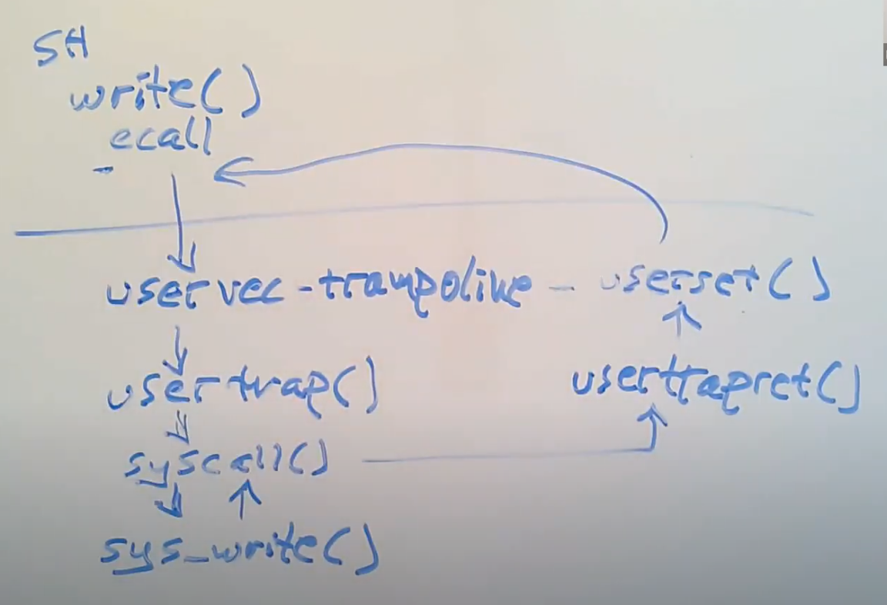

# Lec06 Isolation & system call entry/exit (Robert)

- write通过执行ECALL指令来执行系统调用。ECALL指令会切换到具有supervisor mode的内核中。在这个过程中，内核中执行的第一个指令是一个由汇编语言写的函数，叫做uservec。这个函数是内核代码trampoline.s文件的一部分。所以执行的第一个代码就是这个uservec汇编函数。
- 之后，在这个汇编函数中，代码执行跳转到了由C语言实现的函数usertrap中，这个函数在trap.c中。
- 现在代码运行在C中，所以代码更加容易理解。在usertrap这个C函数中，我们执行了一个叫做syscall的函数。
- 这个函数会在一个表单中，根据传入的代表系统调用的数字进行查找，并在内核中执行具体实现了系统调用功能的函数。对于我们来说，这个函数就是sys_write。
- sys_write会将要显示数据输出到console上，当它完成了之后，它会返回给syscall函数。
- 因为我们现在相当于在ECALL之后中断了用户代码的执行，为了用户空间的代码恢复执行，需要做一系列的事情。在syscall函数中，会调用一个函数叫做usertrapret，它也位于trap.c中，这个函数完成了部分方便在C代码中实现的返回到用户空间的工作。
- 除此之外，最终还有一些工作只能在汇编语言中完成。这部分工作通过汇编语言实现，并且存在于trampoline.s文件中的userret函数中。
- 最终，在这个汇编函数中会调用机器指令返回到用户空间，并且恢复ECALL之后的用户程序的执行。

系统调用 ecall 之前的状态
- 作为用户代码的Shell调用write时，实际上调用的是关联到Shell的一个库函数。你可以查看这个库函数的源代码，在usys.s。

ecall 之后的状态

- 根据现在的程序计数器，代码正在trampoline page的最开始，这是用户内存中一个非常大的地址。所以现在我们的指令正运行在内存的trampoline page中。我们可以来查看一下现在将要运行的指令。
- 所以，现在寄存器里面还都是用户程序的数据，并且这些数据也还只保存在这些寄存器中，所以我们需要非常小心，在将寄存器数据保存在某处之前，我们在这个时间点不能使用任何寄存器，否则的话我们是没法恢复寄存器数据的。如果内核在这个时间点使用了任何一个寄存器，内核会覆盖寄存器内的用户数据，之后如果我们尝试要恢复用户程序，我们就不能恢复寄存器中的正确数据，用户程序的执行也会相应的出错。
- 我一直在告诉你们我们现在已经在supervisor mode了，但是实际上我并没有任何能直接确认当前在哪种mode下的方法。不过我的确发现程序计数器现在正在trampoline page执行代码，而这些page对应的PTE并没有设置PTE_u标志位。所以现在只有当代码在supervisor mode时，才可能在程序运行的同时而不崩溃。所以，我从代码没有崩溃和程序计数器的值推导出我们必然在supervisor mode。
- 我们是通过ecall走到trampoline page的，而ecall实际上只会改变三件事情：
- 第一，ecall将代码从user mode改到supervisor mode。
- 第二，ecall将程序计数器的值保存在了SEPC寄存器。我们可以通过打印程序计数器看到这里的效果，

ecall 之后的工作
- 现在程序位于trampoline page的起始，也是uservec函数的起始。我们现在需要做的第一件事情就是保存寄存器的内容。在RISC-V上。

usertrap
- usertrap某种程度上存储并恢复硬件状态，但是它也需要检查触发trap的原因，以确定相应的处理方式。

usertrapret
- usertrap函数的最后调用了usertrapret函数，来设置好我之前说过的，在返回到用户空间之前内核要做的工作。我们可以查看这个函数的内容。

userret
- 返回用户状态。